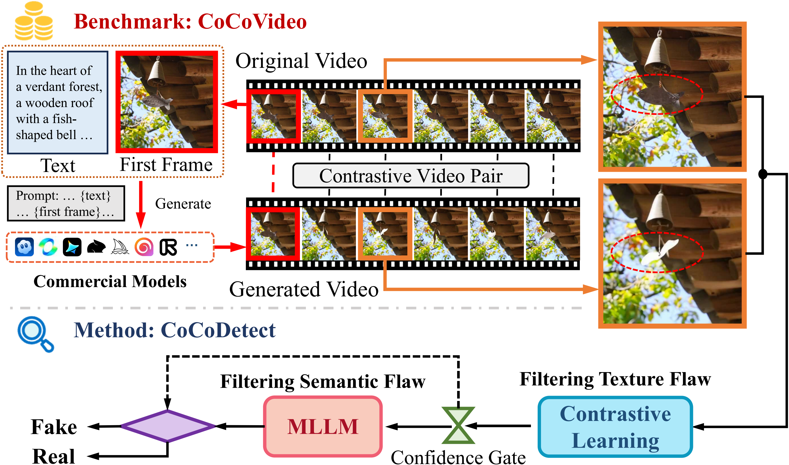

# CoCoVideo

**CoCoVideo: The High-Quality Commercial-Model-Based Contrastive Benchmark for AI-Generated Video Detection**

  

---

## Abstract

With the rapid advancement of artificial intelligence generated content (AIGC) technologies, video forgery has become increasingly prevalent, posing new challenges to public discourse and societal security. Despite remarkable progress in existing deepfake detection methods, AIGC forgery detection remains challenging, as existing datasets mainly rely on open-source video generation models with quality far below that of commercial AIGC systems.
Even datasets containing a few commercial samples often retain visible watermarks, compromising authenticity and hindering model generalization to high-fidelity AIGC videos.
To address these issues, we introduce **CoCoVideo-26K**, a contrastive, commercial-model-based AIGC video dataset covering 13 mainstream commercial generators and providing semantically aligned real–fake video pairs.
This dataset enables deeper exploration of the differences between authentic and high-quality synthetic videos and establishes a new benchmark for highly realistic video forgery detection.
Building on this dataset, we propose **CoCoDetect**, a detection framework integrating contrastive learning with confidence-gated multimodal large language model (MLLM) inference.
An R3D-18 backbone extracts spatio-temporal representations, while a confidence gate routes uncertain cases to an MLLM for reasoning about physical plausibility and scene consistency.
Extensive experiments on CoCoVideo-26K and public benchmarks demonstrate state-of-the-art performance, validating the framework’s robustness and generalizability.
Our code and dataset are available at https://github.com/DonoToT/CoCoVideo.

---

## 🚧 Code and Dataset Release

We are currently organizing the **codebase and dataset** for public release.  
They will be made available in this repository **in the near future**.  